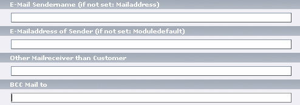
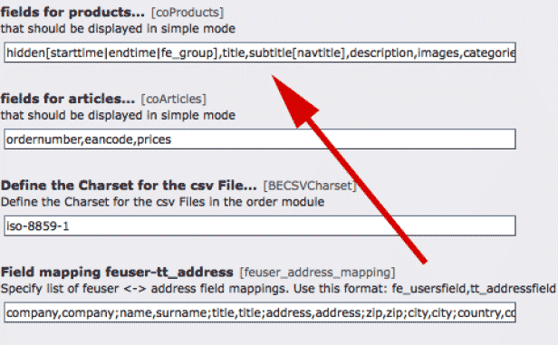
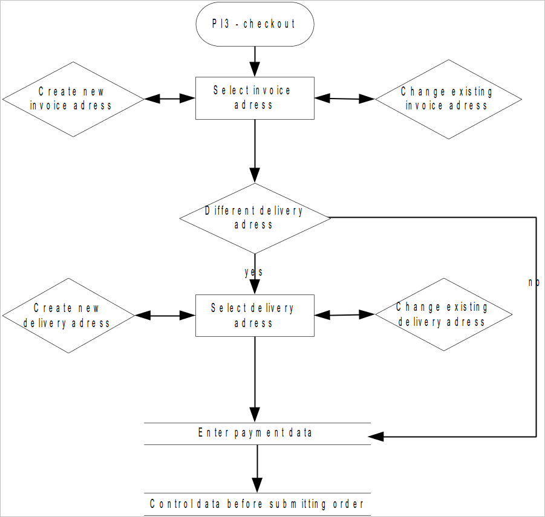

.. ==================================================
.. FOR YOUR INFORMATION
.. --------------------------------------------------
.. -*- coding: utf-8 -*- with BOM.

.. include:: ../../Includes.txt

Configuration
=============

Move Order Mail
---------------

Another interesting feature of Commerce are the so-called **Move Order Mails**, automatic emails, which you can send internally
and to customers as soon as the status of an order has changed and the order was moved to another folder. In this way you can
inform the customer, as soon as you received their payment or sent out the goods.

You can also inform your staff in the shipping department that the goods should be prepared for shipping.

Go to list view of orders in the web module, click on the order Delivered for which you would like to enter the change message
and enter a new record via *Move Order Mail*.

Assign a title for this mail and define first when it has to be sent (i.e. when it is moved into this folder). Select for example
Mail *when move in* and assign a HTML-Template for this message via *Reference to Mailtemplate*. You will find the template for
this example under res/auslieferung.html.

Other templates for Move Order Mails are available in the same folder under paketfreigabe.html and speditionsfreigabe.html.
You can of course include adaptations and templates of your own.

Unless you change further settings, this message will be sent to the customer as soon as their order changes to the status
**delivered**.

If you want to send the mail to additional recipients, e.g. one to the customer, a second one to the shop owner and a third to
the scheduler, you can use the BCC-field. For every recipient and for every Move Order Mail you can use an individual template
with individual text.

   Illustration 18: Move Order Mail - email recipient

HTML-Template
_____________

If you want to use an individual HTML Shop template instead of the default settings, you will find it in the folders
**typo3conf/ext/commerce/pi1** to **../pi6**. It is not possible to copy these files as usual to your template-folder in fileadmin
using the extension manager. But you may download them via FTP from the webserver and move them afterwards. For processing
you have to change the file types from **.tpl** to **.tmpl** or **.html**. You can also add the file type as allowed changes via the
install tool.

Constants
_________

In the constants editor you will find the following settings - in our test shop the PIDs mentioned in the beginning of the
chapter and one of the templates are assigned:

::

	plugin.tx_commerce_lib.addressPid = 18
	plugin.tx_commerce_lib.userPid = 17
	plugin.tx_commerce_lib.basketPid = 11
	plugin.tx_commerce_lib.checkoutPid = 12
	plugin.tx_commerce_lib.emptyBasketPid = 15
	plugin.tx_commerce_lib.emptyCheckoutPid = 16
	plugin.tx_commerce_lib.editAddressPid = 13
	plugin.tx_commerce_lib.overridePid = 2
	plugin.tx_commerce_pi1.templateFile = fileadmin/templates/commerce/category_product.html

With this configuration Commerce already offers an operational shop. Further information on the configuration of Commerce can
be found in the forums and in the mailing lists. A short installation guide comes with the extension. For the sample shop the
implementation of this very comprehensive shop system ends here.

Please keep in mind that Commerce has far more to offer then the basic installation which was described here.

Hooks
-----

The list of all available hooks can be found in the directory /docs in the file hooks.html. We will now show you some examples
for the usage of a hook.

In order to introduce new product fields (FIELD1 and FIELD2) you can proceed as follows:

First of all, create a new extension using the kickstarter. Enlarge the table in the kickstarter where you want to add fields.
For product fields you have to use the table tx_commerce_products. Create a new file within the new extension, where you add a
class with the following functions:

::

	function postInit(&$model) {
		$model->add_fields_to_fieldlist(array('FELD1','FELD2'));
	}

	function additionalMarker($markerArray,$singleViewPlugin) {
		$markerArray['###FELD1###'] = $singleViewPlugin->product->getField('FELD1');
		$markerArray['###FELD2###'] = $singleViewPlugin->product->getField('FELD2');
		return $markerArray;
	}

Include the following code in localconf.php in the root folder of this extension, in order to include the function:

::

	require_once(t3lib_extMgm::extPath($_EXTKEY).'PFAD/ZU_IHRER_HOOK_KLASSE.php');
	$GLOBALS['TYPO3_CONF_VARS']['EXTCONF']['commerce/lib/class.tx_commerce_pibase.php']['singleview'][] = 'NAME_IHRER_KLASSE';
	$GLOBALS['TYPO3_CONF_VARS']['EXTCONF']['commerce/lib/class.tx_commerce_product.php']['postinit'][] = 'NAME_IHRER_KLASSE';

You can now use the marker ###FIELD1### and ###FIELD2### in the template of the product view (pi1/category_product.tpl). The
fields have to be entered in the extension configuration in the field „fields for products“ to be considered.

   Illustration 19: Fields for products

Reference
---------

Plugin Commerce: General
________________________

Constants
_________

The following table contains the overall attributes from the global settings. All features can be set using the constant editor.

.. container:: ts-properties

	=================================== ================= ======================================================================= ==================
	Property                            Data type         Description                                                             Default
	=================================== ================= ======================================================================= ==================
	addressPid                          Integer           PID of the SysFolders, where addresses are stored                       0
	userPid                             Integer           PID of the SysFolder, where new users are stored - tt_address           0
	editAddressPid                      Integer           PID of the page, where address data can be processed                    0
	basketPid                           Integer           PID of the shopping cart page                                           0
	emptyBasketPid                      Integer           PID of the page, where the content element is located, which will be    0
	                                                      displayed when the shopping cart is empty; will be called via the
	                                                      shopping cart page.
	emptyCheckoutPid                    Integer           PID of the page, where the content element is located, which will be    0
	                                                      displayed if the checkout is not possibe; will be called via the
	                                                      shopping cart page (empty order)
	checkoutPid                         Integer           PID of the page of the shopping cart checkout()                         0
	overridePid                         Integer           PID of the page with the list view                                      0
	paymentArticleId                    Integer           article UID of the default method of payment                            1
	payProdId                           Integer           product UID of the default method of payment                            1
	delProdId                           Integer           UID of the default method of delivery                                   2
	catUid                              Integer           default category UID in the frontend                                    2
	currency                            String            ISO-code for the currency (from static_info_tables)                     EUR
	regularArticleTypes                 String            regular type of article (article = 1, payment =2 , delivery = 3)        1
	UserGroup                           Integer           UID of user group for new customers                                     1
	UseRootlineInformationToUrl         Integer           Adds new parameters to the URL in order to speed up presentation of     empty
	                                                      the navigation
	priceFromNet                        Boolean           Consider net price for tax calculation                                  empty
	useStockHandling                    Boolean           Stock management                                                        empty
	currencyId                          Integer           UID of the ISO codes for currencies from (static_info_tables)           49
	showErrors                          Boolean           Error message in frontend                                               1
	displayProductIfOneProduct          Boolean           If a category has one product only, the product list view will be       1
	                                                      skipped and the detail page will immediately be opened.
	hideEmptyCategories                 Boolean           If emty categorie should be hidden (categories with no products in any  0
	                                                      sub category). Setting this to 1 will cause additional load for
	                                                      checking the categories, so it's set to 0
	=================================== ================= ======================================================================= ==================

[tx_commerce_lib.constants]

Plugin Commerce: Display
________________________

.. container:: ts-properties

	=================================== ================= ======================================================================= ==================
	Property                            Data type         Description                                                             Default
	=================================== ================= ======================================================================= ==================
	templateFile                        String            Path to the HTML template                                               EXT:commerce/pi1/category_product.tpl
	attributeLinebreakChars             String            Line break                                                               
	=================================== ================= ======================================================================= ==================

[tx_commerce_pi1]

Plugin Commerce: Basket
_______________________

.. container:: ts-properties

	=================================== ================= ======================================================================= ==================
	Property                            Data type         Description                                                             Default
	=================================== ================= ======================================================================= ==================
	templateFile                        String            Path to the HTML template of the shopping cart                          EXT:commerce/pi2/shoppingcarttpl
	=================================== ================= ======================================================================= ==================

[tx_commerce_pi2]

Plugin Commerce: Checkout
_________________________

.. container:: ts-properties

	=================================== ================= ======================================================================= ==================
	Property                            Data type         Description                                                             Default
	=================================== ================= ======================================================================= ==================
	TemplateFile                        String            Path to the HTML template for administrator – mail upon new orders      EXT:commerce/pi3/template_adminmail.tpl
	AdminMailTemplateFile               String            Path to the HTML template for the checkout (finish order)               EXT:commerce/pi3/template_checkout.tpl
	UserMailTemplateFile                String            Path to the HTML template for customer information after reception of   EXT:commerce/pi3/template_usermail.tpl
	                                                      order
	=================================== ================= ======================================================================= ==================

[tx_commerce_pi3]

Plugin Commerce: Address Management
___________________________________

.. container:: ts-properties

	=================================== ================= ======================================================================= ==================
	Property                            Data type         Description                                                             Default
	=================================== ================= ======================================================================= ==================
	templateFile                        String            Path to HTML Template of address manager                                EXT:commerce/pi4/template_addresses.tpl
	minAdressCount                      Integer           Defines the minimum number of addresses, a customer must have. The      1
	                                                      customer can only delete addresses, if the minimum  value is exceeded.
	=================================== ================= ======================================================================= ==================

[tx_commerce_pi4]

Reference lib.tx_commerce.articles
__________________________________

.. container:: ts-properties

	=================================== ================= ======================================================================= ==================
	Property                            Data type         Description                                                             Default
	=================================== ================= ======================================================================= ==================
	stdWrap                             stdWrap           Wrap around single article
	defaultField                        stdWrap           Standard Wrap around every field which is not defined in the fields
	                                                      selection
	DefaultQuantity                     Integer           Standard amount of articles. Replaces                                   0
	                                                      tx_commerce_pi1.defaultArticleAmount
	fields                              COA               The field-objekt -> see Reference fieldObject
	addToBasketLink                     TypoLink          Typolink feature which allows putting articles directly in the
	                                                      shopping cart
	=================================== ================= ======================================================================= ==================

Reference fieldObject
_____________________

A FieldObject is a field list, which can be defined as IMGTEXT, IMAGE, IMG_RESOUCRE, STDWRAP.
Every database field in a table can be defined as such an object.

Example
::

	fields {
		// every column in this table could be  wraped with the
		// stdWrap, IMAGETEXT, IMAGE

		title = stdWrap
		title {
			wrap = |
		}
		description_extra = stdWrap
		description_extra {
			parseFunc < lib.parseFunc_RTE
		}
		images = IMAGE
		images {
			defaultImgConf {
				file.import.current = 1
			}
			file.maxW = 150
		}
	}

For the field types IMGTEXT, IMAGE, IMG_RESOURCE the Property imgPath can be defined. If this is not defined in TS, the
defaultpath uploads/tx_commerce will be used.

.. container:: ts-properties

	=================================== ================= ======================================================================= ==================
	Property                            Data type         Description                                                             Default
	=================================== ================= ======================================================================= ==================
	imgPath                             String            Path to the image files; has to end with a / (Slash)                    If not defined: uploads/tx_commerce
	=================================== ================= ======================================================================= ==================

Reference pi1 (Listing)
_______________________

.. container:: ts-properties

	=================================== ================= ======================================================================= ==================
	Property                            Data type         Description                                                             Default
	=================================== ================= ======================================================================= ==================
	defaultArticleAmount                Integer           Standard number of articles
	maxRecords                          Integer           Maximum amount of records shown per page
	templateMarker                      String            Configuration of single template-marker
	allArticles                         Boolean           Defines whether all articles or a selectbox will be displayed for a     1
	                                                      selection of articles. For select boxes the value has to be set to 0.
	                                                      JavaScript is needed for selectboxes
	hideProductsInList                  Boolean           Hide all products in the category list (show categories only)
	displayTopProducts                  Boolean           Display of top products
	checkCategoryTree                   Boolean           If activated, the sub-categories submitted with GET-parameter will be
	                                                      checked against the main categories, which are also submitted. If the
	                                                      subcategory is not below this main category, the main category will be
	                                                      shown.
	hideEmptyProdAttr                   Boolean           Hide empty product attributes
	hideEmptyShalAttr                   Boolean           Hide empty „Shall“-attributes
	hideEmptyCanAttr                    Boolean           Hide empty „Can“-attributes
	showHiddenValues                    Boolean           Show hidden values
	singleView                          COA
	 .renderProductNameAsPageTitle      Integer           0. don't render product title as page title
	                                                      1. render always product title as page title
	                                                      2. only render product title as page title if product was not set by
	                                                         plugin settings (select product) and if product was not set by TS
	 .categories                        COA               TS Setup for display in a single category
	listView                            COA               configuration of product-list view
	listViewTop                         COA               configuration of top-product list view
	general_stdWrap                     stdWrap           overall stdWrap
	categoryListView                    COA               configuration of category list
	attributeLinebreakChars             String            String for separation of attribute values in select boxes                
	mutipleAttributeValueWrap           stdWrap           stdWrap around every attribute value for several selected attributes
	mutipleAttributeValueSetWrap        stdWrap           stdWrap around the attribute select box for several selected attributes
	=================================== ================= ======================================================================= ==================

[tx_commerce_pi1]

Reference pi2 (Basket)
______________________

.. container:: ts-properties

	=================================== ================= ======================================================================= ==================
	Property                            Data type         Description                                                             Default
	=================================== ================= ======================================================================= ==================
	templateFile                        String            Template file
	delProdId                           Integer           UID of the default delivery method (delivery product ID)
	payProdId                           Integer           UID of default – payment method (payment product ID)
	regularArticleTypes                 String            Regular type of article (article = 1, payment =2 , delivery = 3)
	listPid                             Integer           PID of the list view
	checkoutPid                         Integer           PID of checkout
	defaultPaymentArticleId             Integer           ID of article of default payment method
	templateMarker                      String            configuration of template marker
	fields                              COA               the fieldObject -> see reference fieldObject
	payment.allowedArticles             String            Comma separated list of allowed methods of payment (UIDs).              false
	                                                      This selection can be overwritten by the hook **makePayment**
	delivery.allowedArticles            String            Comma separated list of allowed methods of delivery (UIDs).             false
	                                                      This selection can be overwritten by the Hook **makeDelivery**
	=================================== ================= ======================================================================= ==================

Reference pi3 (Checkout)
________________________

.. container:: ts-properties

	=================================== ================= ======================================================================= ==================
	Property                            Data type         Description                                                             Default
	=================================== ================= ======================================================================= ==================
	templateFile                        String            HTML Template for the order page
	addressMgmPid                       Integer           The PID for the page which will be used for the address management.
	regularArticleTypes                 String            Regular article type, see constants
	usermail                            -> mail           Configuration of confirmation mail, which the customer receives
	adminmail                           -> mail           Configuration of confirmation mail, which the administrator receives
	currency                            String            ISO-code of currency
	billing                             -> form           Forms configuration for billing adress
	 .deliveryAddress.delivery_radio    stdWrap           Wrap for the radio button for the selection of a delivery address
	 .deliveryAddress.nodelivery_radio  stdWrap           Wrap for the radio button in case no billing address equals a delivery
	                                                      address
	 .deliveryAddress.delivery_label    stdWrap           Wrap for the label for the selection of a delivery address
	 .deliveryAddress.nodelivery_label  stdWrap           Wrap for the label, of no billing adress equals a delivery address
	delivery                            -> form           The forms configuration for the delivery address
	createNewUsers                      Boolean           If set, a new user will be created during checkout, if the customer
	                                                      has not been logged in.
	userPID                             Integer           PID of SysFolder with the frontend users
	userGroup                           Integer           The UID of the user group which will be assigned to new users, in case
	                                                      registration was finished regularly.
	termsdefaultchecked                 Boolean           Terms and conditions selected by default?
	paymentIsDeliveryAdressDefault      Boolean           Default setting, whether invoice and delivery address are the same.
	deliveryAdressIsSeparateDefault     Boolean           Default setting, whether there is a separate delivery address
	addressPid                          Integer           PID of the sysFolder with tt_address data
	cantMakeCheckout                    Boolean           disallows checkout
	=================================== ================= ======================================================================= ==================

[plugin.tx_commerce_pi3]

   Illustration 16: Checkout process

Reference pi4 (Address management)
__________________________________

.. container:: ts-properties

	=================================== ================= ======================================================================= ==================
	Property                            Data type         Description                                                             Default
	=================================== ================= ======================================================================= ==================
	templateFile                        String            The HTML template for the address management plugin
	minAddressCount                     Integer           Minimal amount of addresses which have to be allocated to a single      1
	                                                      user. Is used to check whether an address can be deleted.
	selectAddressTypes                  String            Comma separated list of address types which can be processed by a       1,2
	                                                      plugin.
	editAddressPid                      Integer           PID of the page where address data can be processed
	addressPid                          Integer           PID of the sysFolder with tt_address data
	addressHeaderWrap                   stdWrap           Wrapper for the heading of the list of addresses
	editLinkWrap                        stdWrap           Wrapper for the link for processing of addresses
	deleteLinkWrap                      stdWrap           Wrapper for the link to delete an address
	newLinkWrap                         stdWrap           Wrapper for the link to enter an address
	yesLinkWrap                         stdWrap           Wrapper for the confirmation button to delete an address
	noLinkWrap                          stdWrap           Wrapper for the abort button for deletion of an address
	sysMessageWrap                      stdWrap           Wrapper for all messages coming from the system, e.g. error messages
	hideEmptyFields                     Boolean           If set, empty fields will be removed from the list view; does not       0
	                                                      concern the processing view.
	emptyFieldSign                      String            If hideEmptyIField is not set: Marker, which will be shown instead of
	                                                      a field value.
	formFields                          -> form           Defines the form fields, which are used for processing of addresses
	mandatorySign                       String            Sign for mandatory fields                                               *
	=================================== ================= ======================================================================= ==================

[plugin.tx_commerce_pi4]

Reference pi6 (Invoices)
________________________

.. container:: ts-properties

	=================================== ================= ======================================================================= ==================
	Property                            Data type         Description                                                             Default
	=================================== ================= ======================================================================= ==================
	decode                              Boolean           Set to 1, of you want to create invoices as pdf-file                    0
	currency                            String            ISO-code of currencies
	showCurrencySign                    Boolean           If 1, the currency symbol will be printed in the invoice
	invoiceheader                       Image resource    If a screen resource is given, the image will be included in the
	                                                      standard HTML template of the invoice (letter head).
	shopname                            stdWrap           Name of the shop
	shopdetails                         COA               Additional information concerning the shop, e.g. the address
	intro                               stdWrap           Introductory text which will be displayed in the beginning of the
	                                                      default template (welcome to the shop...)
	thankyou                            stdWrap           Final phrase in the end of the default templates (Thank you very much
	                                                      for shopping with us...)
	=================================== ================= ======================================================================= ==================

[plugin.tx_commerce_pi6]

Reference navigation.special
____________________________

.. container:: ts-properties

	=================================== ================= ======================================================================= ==================
	Property                            Data type         Description                                                             Default
	=================================== ================= ======================================================================= ==================
	category                            Integer           CategoryUID: Starting category for the navigation                       {$plugin.tx_commerce_lib.catUid}
	showProducts                        Boolean           If products should be shown in the navigation                           0
	overridePID                         Integer           PID for genertaing Links in the Navigation                              {$plugin.tx_commerce_lib.overridePid}
	entryLevel                          Integer           Entry Level for the navigation                                          0
	maxLevel                            Integer           Maximum Level to be generated in the Navigation. Since a complete       PHP_INT_MAX
	                                                      Array of all levels (regardless the Menu Configuration) will be
	                                                      rendered, this could use much memory
	noAct                               Boolean           If activated the navigation will only generate menuelements in the      0
	                                                      stat NO. If you don't need any active elements in the navigation, this
	                                                      could speedup the generation process
	hideEmptyCategories                 Boolean           Hides empty Categories                                                  {$plugin.tx_commerce_lib.hideEmptyCategories}
	additionalFields                    String            Addtional Fields which sould be added to the Menu Navigation
	expandAll                           Boolean           Expand all. This must be set in special not in MENU object
	=================================== ================= ======================================================================= ==================

[lib.tx_commerce.navigation.special]

-> mail
_______

.. container:: ts-properties

	=================================== ================= ======================================================================= ==================
	Property                            Data type         Description                                                             Default
	=================================== ================= ======================================================================= ==================
	showCurrency                        Boolean           If set, the currency will be shown in the confirmation mail.            0
	charset                             String            Charset of the mail                                                     utf-8
	encoding                            String            Encoding of the mail                                                    8bit
	from                                String            The sender address of the shop                                          shop@example.com
	from_name                           String            name of the sender                                                      Commerce ShopMaster
	cc                                  String            Additional CC-addresses, comma-separated
	bcc                                 String            Additional BCC-addresses, comma-separated
	mailto                              String            **Administrator**'s email                                               administrator@example.com
	templateFile                        String            HTML-template of the mail
	=================================== ================= ======================================================================= ==================

-> form
_______

The Commerce forms are not static. They will be rendered dynamically depending on the configuration. The options will be set
via TypoScript.

Overall settings:

.. container:: ts-properties

	=================================== ================= ======================================================================= ==================
	Property                            Data type         Description                                                             Default
	=================================== ================= ======================================================================= ==================
	addressType                         Integer           Address type to be processed in this form
	userConnection                      String            Defines the field in the source table (e.g. tt_address) makes the       tx_commerce_fe_user_id
	                                                      connection to the frontend user.
	sourceTable                         String            Table, where addresses are stored                                       tt_address
	sourceLimiter                       -> sourceLimiter  Mandatory fields
	sourceFields                        -> sourceFields   Fields to be displayed
	=================================== ================= ======================================================================= ==================

Two of the features are of secondary importance:

-> sourceLimiter
''''''''''''''''

.. container:: ts-properties

	=================================== ================= ======================================================================= ==================
	Property                            Data type         Description                                                             Default
	=================================== ================= ======================================================================= ==================
	field                               String            Default field                                                           tx_commerce_address_type_id
	value                               String            Default value
	=================================== ================= ======================================================================= ==================

-> sourceFields
'''''''''''''''
Die Sourcefields definieren für jedes einzelne Feld einer Tabelle wie es verarbeitet und gerendert wird. Der Schlüßel ist immer
der Name der Quelltabelle. Jedes Feld hat spezielle Eigenschaften.

.. container:: ts-properties

	=================================== ================= ======================================================================= ==================
	Property                            Data type         Description                                                             Default
	=================================== ================= ======================================================================= ==================
	type                                String            Defines rendering of the field in the frontend. Possible values:        input
	                                                       - single (simple input field)
	                                                       - select (Selectbox)
	mandatory                           Boolean           Mandatory field                                                         0
	eval                                String            Validation of single fields. The comma-separated list of methods:
	                                                       - email (entered value must be a valid email-address)
	                                                       - username (checks, whether this username already exists)
	                                                       - string (checks, whether the entered value is a string)
	                                                       - int (checks, whether the entered value is an integer)
	                                                       - min (minimum value. Has to be separated by the keyword with an
	                                                         underscore, e.g. min_10)
	                                                       - max (maximum, see min)
	                                                       - alpha (the entered value must be alpha-numeric)
	table                               String            Defines the table, the values come from
	select                              String            Where-Clause for the SELECT-query                                       1
	label                               String            The table-field which shall be assigned as field name
	value                               String            The field that is used as value for the option elements.
	default                             String            Default value, these values will be set as default in the form
	readonly                            Boolean           If set, the field cannot be changed in the frontend
	Maxlength                           Integer           Maximum field-length of an input field; no validation by server!
	orderby                             String            Field name by which the results are sorted.
	=================================== ================= ======================================================================= ==================

PageTSconfig
____________

.. container:: ts-properties

	=================================== ================= ======================================================================= ==================
	Property                            Data type         Description                                                             Default
	=================================== ================= ======================================================================= ==================
	category.defaultTaxValue            Integer           Default tax rate
	orders.delProdUid                   Integer           Limitation of display to orders with the given product.
	orders.payProdUid                   Integer           Limitation of display to orders with the given payment method.
	category.defaultTaxValue            Integer           Default tax rate, if not set for the article
	=================================== ================= ======================================================================= ==================

[mod.commerce]