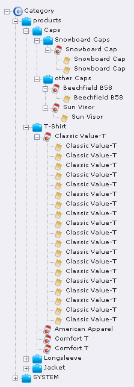
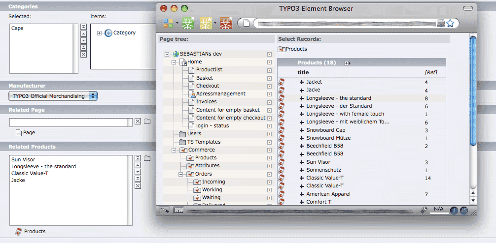
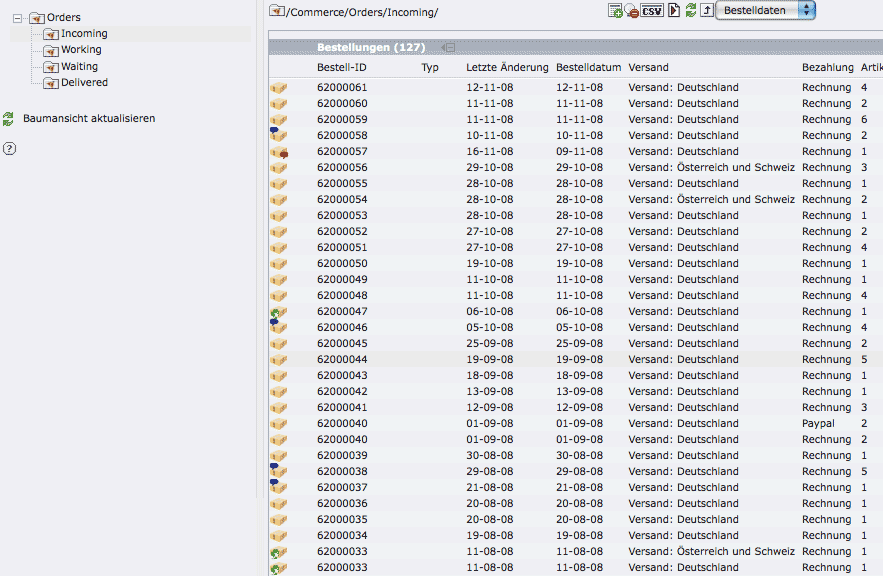
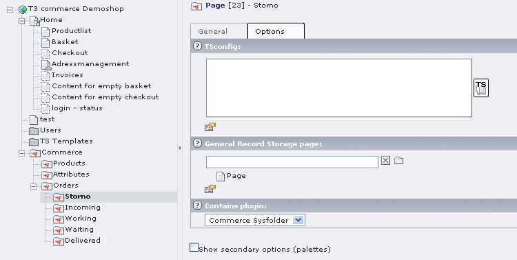
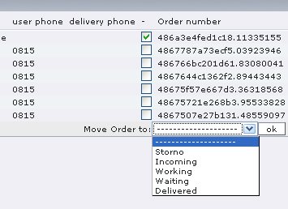
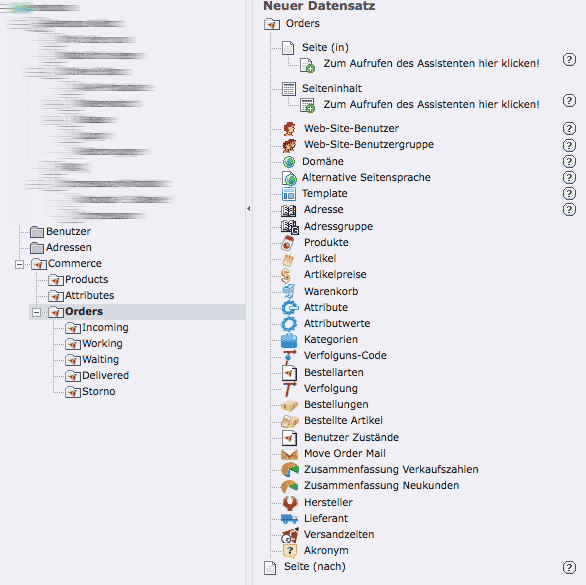
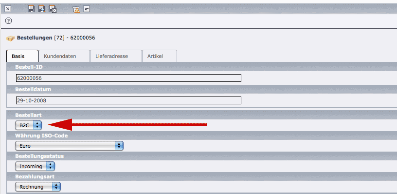
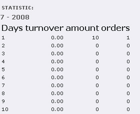

.. ==================================================
.. FOR YOUR INFORMATION
.. --------------------------------------------------
.. -*- coding: utf-8 -*- with BOM.

.. include:: ../../Includes.txt

Webmodule Commerce
==================

Webmodul Commerce
-----------------

Now – or after having cleared the cache – you see the category **Commerce** in the webmodule with its subcategories Category,
Orders, Systemdata and Statistics.

.. figure:: ../../Images/webmodule.jpg
   :align: LEFT

   Illustration 8: Webmodule Commerce

Categories
__________

Commerce manages products and the corresponding articles in so-called **categories**. The presentation of the category-tree in
the backend is done by the extension **Graytree Library**. There are main categories and subcategories for the management of
products and articles.

Go to the web module **Commerce** and click on **category** in order to create the first category. There is an entry *system* in
the list, where you have to select *create new record* → **category** and assign a name in the back end form, in our example
*Clothing*. It has the UID **2** in our sample configuration, which is preset in the constants already. In case this category
should not be your main category, assign the UID of the desired main category in the constants.

Now create a subcategory, ie. within **clothing** another category **t-shirts** and if required another subcategory, e.g.
**t-shirts for children**. You can also click on every category with the left mouse button in order to insert additional
subcategories using **new subcategory**.

It is not possible to move products to other categories using copy/paste. If you would like to move a product into another
category, you have to open the product and assign another category using the form. You can see the corresponding form and a
view of the category tree in illustration 9.

   Illustration 9: Category tree

Products
________

You can enter the single products via the category-module, e.g. in **t-shirt** via *create new record → products*. Assign a title
and a short text for information, add a picture and save the record. All other information such as teaser text, teaser image
(for the preview) etc. can be entered using the „**general**“ tab. In the beginning, we will not consider the other tabs.
Unfortunately it is not possible to save an alternative text for an image in Commerce, which would be required for a accessible
shop for people with disabilities.

In the categories' page tree you will now find your product in the category hierarchy, i.e. here in the category clothing the
sub-category **t-shirt** with the product **t-shirt**. Within this subcategory there is another subcategory called **t-shirts for
children**.

Products are parent elements of all specific versions of a product, i.e. the articles that are really ordered. An article is
defined within the category t-shirt by weight of fabric, size, color etc. But before creating an article please have a short
look at the subjects payment and delivery, as the corresponding methods are also defined in categories.

Related pages
_____________

You can assign a link on any page of the website to a product, making the page a related page. On the General tab in the product
record you can select the page and assign it to the product.

Related products
________________

In Commerce you can assign related products to another product. These „related products“ will be displayed in the single view of
the product and can also be ordered there. To make this link visible in the frontend, the marker ###RELATED_PRODUCTS### has to be
set in the template pi1/category_product.tpl.

Select the desired product in the backend and enter the related products in the „General“ tab.

   Illustration 10: Related products

Payment and delivery
____________________

The allowed methods of payment are defined in the **Payment** section. In Commerce the backend form for the payment methods is
comparable to the one for the articles. Some methods are pre-set, but can be changed and enlarged. Select for example the
payment method **cash on delivery** and change the title in the **general tab** to Nachnahme. Move to the price tab and enter the
price for **cash on delivery**.

In order to insert a new method of payment, you have to create another „article“. Select the „product“ PAYMENT form the list
shown in the illustration and the **tab „create article“** in the form that will be displayed. Select the **tab creatable articles**,
check the box create an empty record and save it. In your category tree there will be a new payment method. You can edit the
corresponding record and set up the new payment method. The same procedure is valid for the delivery methods.

Master data
___________

Leave the categories for some other preparations and have a look at master data. You will have to complete the product
informations there. Go to the web module **Commerce**, select the entry **Master Data**, which gives access to other entries.

An important feature in Commerce are the attributes. An **attribute** characterizes a product („size“, „color“, „fabric“)
and corresponds to a certain **value** („XL“, „red“, „cotton“). The different attributes lead to the articles that will
later on be ordered by the customers, e.g. a red cotton t-shirt in size XL. In order to test this, you need to define
some attributes first and assign values to them.

Via **new attribute** you can create an attribute (eg. weight), give it a title and a unit (eg. gramme). You can also add
an image as symbol for the weight.

Check the box for „**has list of values**“, because as soon as you save the attribute, you can assign values to it. Click
the tab **assigned values** and create the corresponding values.

In the example, the values **100**, **200** and **300** were assigned as weight/quality of fabric for shirts. In the backend form
you can define that the unit gramme shall be displayed using integer values. After this you can define a second attribute
**color** and assign possible values.

An attribute can have an icon, too.

For products you can additionally save information on the **manufacturer**, e.g. *manufacturer of the t-shirt*.

The same applies to **suppliers**. In the sample shop a **t-shirt- supplier** was created.

Products and articles
_____________________

With these steps, all preparations for the creation of the single articles are done, as the articles will be specified using
the attributes and addresses we just defined.

Now go back to the categories.

Select the parent product **t-shirt** in the category tree and there the tab **select attribute**. In the field **selection**
you can assign the attribute objects **weight** and **color** and save the record.

Create an article
'''''''''''''''''

Switch to the tab **create article** and go there to the section creatable articles, which opens a list with checkboxes. If you
do not want to select one of the attributes, you can **create an empty record**, that is one for every article you want to sell
for a product. These articles will be assigned attributes from a list box in the tab **existing articles**. If you **select all
articles**, all articles that result from the combination of the attribute values will be created. If a t-shirt is available in
three colors and three different types of fabric, you will automatically get 9 different articles. If you do not want to offer
all combinations, as the white t-shirt is only available with a weight of 100 g, check the corresponding combination of values.
After saving the record your article will be displayed beneath the product.

Go back to the parent product **t-shirt** and select the tab **select attributes**.

In the field **Should** you have to set all attributes being only relevant for one single article. It is up to the editor to
enter the desired data. In our example, the attribute **washability** was first added without a list of values. If you edit the
attributes in the article – not in the product! - you will see a field beneath the heading washability, where you can enter
the temperature for washing. In this case, the attribute is only valid for this single article. If you change your mind, you
can create a list of values at a later stage. In this case, the values you entered manually, will be automatically integrated,
if you check the box for **has list of values**. Of course you can also add other values.

Enter all attributes in the field **Can** that can apply. For example the t-shirt can have an appliqué on the front and on the
back side. This attribute has a list of values with the values front and back, and when you edit the attributes in the article,
you can assign one of the values.

All attributes with global values belong to the field **product**, ie. those being valid for all articles of the product. An
example would be **material**, in case all articles are made of the same material. Create an attribute, assign it via **product**
in the product record and save the record. You will then see another tab **edit attributes**, where you can assign the attribute.
You can only select one global value for a product and all corresponding articles. In the frontend you will see the single
view of the product which is not visible for every article. In our sample shop all t-shirts are made of „100% cotton“.

In the field **filter attributes** you can set those attributes, which will later on be used for the search or other filters.
As these filter attributes are very complex and have to be assigned for every shop on an individual basis, every shop owner
has to implement those filter attributes by themselves. Currently they are still implemented as an extension and require some
programming work. You can set up complex AND or OR connections with individual differences for every shop.

In the article you also have to enter the corresponding tax rate.

In case the tax rate is the same for all articles or for most articles, you can define it via TypoScript, too:

::

	mod.commerce.category.defaultTaxValue = 19

If the manufacturer is the same for all articles of the product, it will be assigned via the product (not the article). The
supplier can depend on the article and the type of delivery and will be defined by one of both categories.

In the **prices** tab of an article you will find several input methods. First, assign a price of EUR 10.- and set **1** for
**tier price from** and **tier price to**. If you enter 10 for **tier price to**, the price will be valid for orders up to 10
items of the article.

If you would like to define a different price for 11 – 20 items, please check **add new price** first and save the record. After
this you can define another tier price of EUR 8.- for example using the values 11 respectively 20.

Using the wizard you can also create tier prices automatically. You have to enter the the initial quantity in „tier price initial
quantity“. In „tier price quantity“ you can fix how many tier prices are to be created. In „tier prices steps“ you will have to
enter the extra charge for every price.

Tier prices can also be fixed for a distinct time by defining the start- and stop-date. You can even fix group prices using the
field **access**. If you want to offer tier prices for user groups, you have to create a new price or new tier prices for any of
those groups. Keep in mind that this can soon become confusing and thus prone to errors. If a user is assigned to serveral user
groups – which should be avoided – he gets the best price.

Shopping Cart
_____________

You can start the first test orders from the list view by putting articles in your cart. The shopping cart view you will then
see provides you with an overview with prices at the right. The default order is: net total for products, gross total for
products, net shipping cost, gross shipping cost, net handling fees, gross handling fees (in case you included those additional
costs in your payment methods.)

Orders
______

Switch in the category **Commerce** to orders. In Incoming you can find all test orders, i.e. all orders that have not yet been
processed by the shop administrator. By clicking on the icon in front of the record, you will see the entire order record.

If you click on the email address of a customer, the view will be split up in customer and order data. Using the combobox in the
upper right you can switch between those two views.

In order to move the order into another folder, eg. from Incoming to Working, you have to check the box at the end of the order
and select the corresponding folder or select the order by clicking on the icon in front of the order (right mouse button → edit).
In doing so you can see the status of the order (tab customer date), **delivery address** and **article**, until the goods are
delivered and the transaction is closed.

   Illustration 11: Order list

There is an icon in front of every order. If the order contains a comment from the shop, the icon will get a red flag. If there
is a comment from the customer, there will be a blue icon. And if the order shall be sent to an alternative adress, there will
be a green flag.

Moving orders into another folder
'''''''''''''''''''''''''''''''''

Orders can be moved into other folders, as soon as the status of the order has changed, e.g. from „incoming“ to „working“.

Deleted and cancelled orders should immediately be moved into a cancellation-folder, which will not be included in the
aggregation (comp. Statistics). Otherwise the amounts will go into your „real“ orders and distort your statistics.

In order to exclude orders from aggregation, you have to enter the UIDs in the constant editor in „ excludeStatisticFolders“.

Creating a new folder for cancelled orders
^^^^^^^^^^^^^^^^^^^^^^^^^^^^^^^^^^^^^^^^^^

Create this folder as sysFolder in the „orders“-area. In the field includes extension you can assign **Commerce system folder**
(see illustration).

   Illustration 12: creating a folder for cancellations

In the web module \menu{Commerce\sm orders} you can now move your cancelled orders via the combobox into this folder.

   Illustration 13: Move order in cancellation folder

Export orders
^^^^^^^^^^^^^

If you would like to export all orders of a folder, including all available fields, then export the file via the csv-symbol
and re-include it into the desired program. You can also write a short php-script and integrate all data directly into your
invoicing system.

Types and states of order
'''''''''''''''''''''''''

A type of order classifies the order. It can be done manually. The same applies to the users' state. You could for example
define the order types B2C and B2B and assign one of them to any order.

You can also assign a good or a bad payment history to customers.

Types and states of orders will be set using the web module list in the folder **orders** (create new record).

   Illustration 14: Create new record: type and status of orders

As soon as you have created a type of order, e.g. B2C, you can select it using the combobox type of order and assign it.

   Illustration 15: Select type of order

A user state will be set in the folder customersysFolder and assigned to the user, using the corresponding listbox on the
„advanced“ tab.

Statistics
__________

Stay in the web module Commerce, but go to statistics, in order to view the statistics for your orders. In this context, the
term **aggregation** is important, i.e. the total of values in a table. In this case it is the total of orders. The statistics
will be saved in so-called aggregation-tables. You have to start the complete aggregation once.

.. figure:: ../../Images/aggregation.jpg
   :align: LEFT

   Illustration 16: Aggregation

There might be a great amount of data for capture and processing. It is thus possible that the time needed for calculation
exceeds the maximum allowed script runtime (which is set to 30 seconds by default). If you get an error message such as
„...Maximum execution time ...exceeded“, you have to increase the maximum script runtime in the php.ini-file by entering a
higher value for max_execution_time (for example 300 for 5 minutes).

You can also run the generation process as CLI-script, for example as regular cron job:

::

	/pfad_zur_installation/typo3/cli_dispatch.phpsh commerce  statistics incrementalAggregation
	/pfad_zur_installation/typo3/cli_dispatch.phpsh commerce  statistics completeAggregation

It will capture and evaluate all orders. After this you only need to activate the surplus aggregation, in order to get changes
in the database. This will take much less time then a complete evaluation.

With the selection statistics in the list box you will get an overview, which does not include the orders of the current day,
though. Statistics for single days, months or hours will also be possible.

   Illustration 17: Daily statistics

If you would like to print or further process statistics, then simply copy the entire table und paste it into a spreadsheet.
