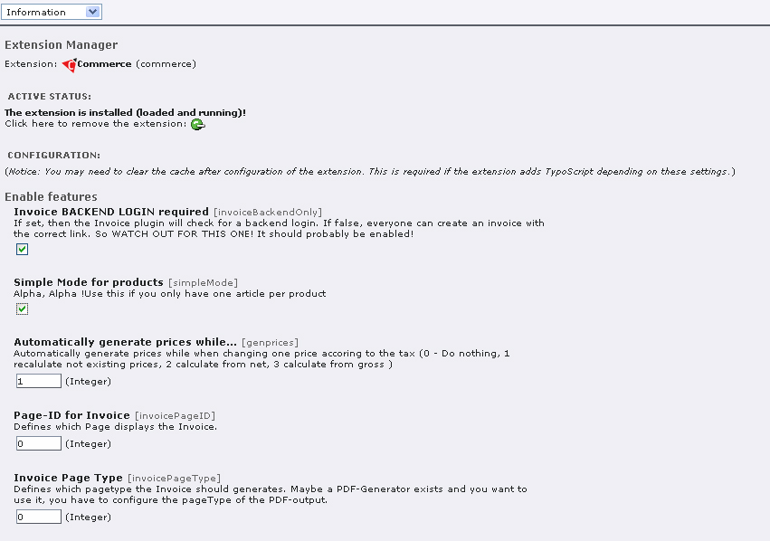

.. ==================================================
.. FOR YOUR INFORMATION
.. --------------------------------------------------
.. -*- coding: utf-8 -*- with BOM.

.. include:: ../Includes.txt

Installation
============

A quick introduction can be found in the doc-directory **commerce_quickinstall.txt**.

Install the extension with the key commerce and all other required extensions in the Extension Manager. Before starting the
configuration of Commerce, some pages of the shop need to be set up and some other preparations are required too.

PHP version 5.3.x and TYPO3 version 6.2 are needed here.

The following extensions need to be installed and running:

- Commerce Extension Key: commerce
- Address list, Extension Key: tt_address
- Dynamic Flexforms, Extension Key: dynaflex
- Money code Library, Extension Key: moneylib
- Static Info Tables , Extension Key: static_info_tables
- Optional: Frontend User Registration, Extension Key: sr_feuser_register

Additionally, a Login Extension is required/ recommended.

You may install **felogin** (system extension with 4.2) and define a redirect after logout. This is important, because otherwise
a user would get an error message if he wants to log out from a product page, as the page or the content will no longer be
available after logout. This would cause an error message or display of an empty page. If you define a redirect after Logout,
this problem will not arise.

Basically, there are two modes for the installation of Commerce. The Simple Mode implies an easier installation of the shop,
whereas the standard mode provides all functions.

Simple Mode is a light installation of the shop. In **Simple Mode** there shall only be one article and price per product.

In order to do so, you have to activate the Simple Mode in the Extension Manager first. Check the corresponding box.

   Illustration 1: Activation of simple mode in extensionmanager