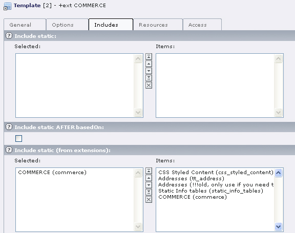
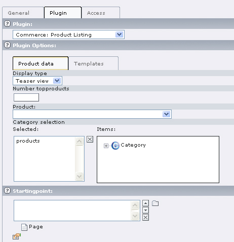
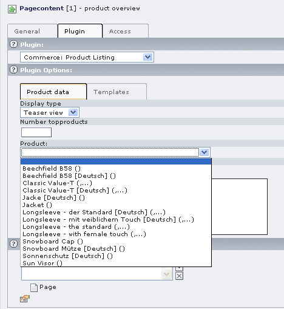
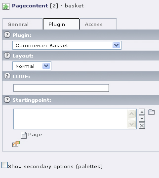
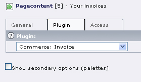
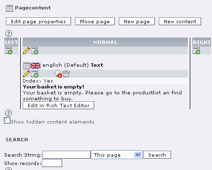

.. ==================================================
.. FOR YOUR INFORMATION
.. --------------------------------------------------
.. -*- coding: utf-8 -*- with BOM.

.. include:: ../Includes.txt

User Guide
==========

TS-Template
-----------

Create a new TS-Template for Commerce in your Template-SysFolder. Name it **+commerce**, assign the static template COMMERCE via
**Include static (from extension)** and save the record. Include this template as usual in the TS-Template of your root page.

   Illustration 2: Assign static template

Pages and Plugins
-----------------

Now you have to create the pages required for your shop.

List view
_________

„Shop“ will be the main page of your shop, where products and articles are listed. In contrary to other pages which will be added
later, this page shall be visible in the menu. Assign the plugin to this page. Select „General plugin“ from the list and
**Commerce: Product List** in the form. At the moment we will not consider the plugin-options of the flexforms. You can also
ignore the starting point, as it does not need to be defined in the Commerce-shop. Then save the record.

   Illustration 3: Plugin list view

If you want to have a list view, which only displays a distinct product with its related articles (e.g. one type of trousers in
different colors) you have to select the desired product in the field **detail product (for single view)** and save the record.
This is, of course, not yet possible, as the products and articles do not exist.  On this page, you will only see the selected
product with the corresponding articles.

   Illustration 4: Single product

Single view
___________

You reach the single view of a product in the frontend by clicking on the product title. It is not necessary to create a separate
page for the single view, because it will always be shown on the same page as the list view. A text which you assign to the
parent element -instead of the single articles – will be displayed on click on the title of the parent element (which is the
product). This corresponds to the single view of the product.

Shopping cart
_____________

Create a page for the shopping cart and assign the plugin (general plugin). In the form you have to select
**Commerce: shopping cart** from the list of extensions and save the record.

Orders
______

For the final order you need another shopping cart page. Select the **General Plugin** and **Commerce: Checkout** from the
extensions in the form. Then save the record.

Address management
__________________

Create a page for the management of addresses: **General Plugin**, in the form **Commerce: Address management**.

   Illustration 5: Plugin shopping cart

Invoice
_______

Create a page for the invoices. You already know how to do this: **General Plugin** and **Commerce: Invoice**.

   Illustration 6: Plugin Invoice

Page and Content „empty shopping cart“ and „empty order“
________________________________________________________

Create a text page which will be visible in the frontend if the shopping cart is empty or if an order does not yet exist. Create
the text for these pages (e.g. „Your shopping cart is empty“ or „Please select an article“) and save the record.

SysFolder
_________

Create two sysFolders, one for user addresses and one for customer addresses. The addresses will be managed by the extension
**tt_address** in the folder **addresses**. You need two different folders, as the frontend user registration used by Commerce
only knows one address per user, whereas Commerce has a separate address for invoice and delivery. Several adresses are thus
possible for every user.

Management of users will be done in the sysFolder Users. The address has to be entered in the checkout at the latest. If the user
cancels the order at a later stage their data will not be saved in the system. If the order is completed, user data and orders
will be saved in this folder.

With the confirmation of the order the customer will receive their user name and a password they can use for future purchases in
the shop.

   Illustration 7: Page content for an empty shopping cart

Assign PIDs
___________

If all necessary pages for the shop are created, switch to the Extension Manager and assign the PID of the **Invoice** page
(Page-ID for Invoice) and the list view Preview Page Type. Finally click **Update** and open the TS-Template +commerce.

Assign the other IDs via the Constant-Editor and make other settings, if required. In order to do so, select the category
PLUGIN.COMMERCE: GENERAL.

Check the box for every entry in the area **Links and Targets** and click the Update-Button. Now enter the PIDs of the pages.

- Address PID: SysFolder of customer addresses
- USER PID: SysFolder of front end users
- Edit Address PID: address management page
- Basket PID: shopping cart page
- Override PID: list view
- Checkout PID: orders page
- Empty basket PID: text page for empty shopping cart
- Empty Checkout PID: text page for empty order

These settings should be enough for the start. We will use the default values for all other constants.

